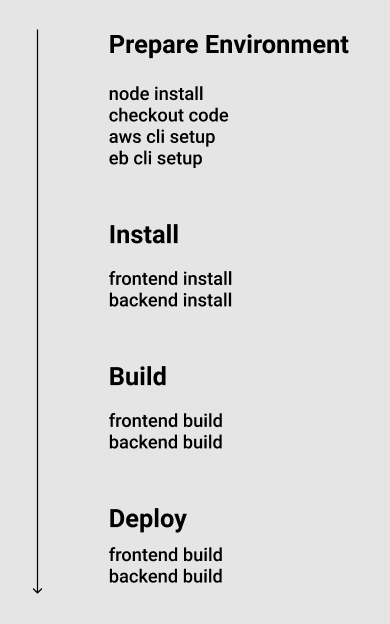

# Pipeline

The pipeline is setup in CircleCI using this repository.

## Overview

1. Orbs to install Node, AWS cli, and EB cli.
2. CircleCi checks out the code from this repo
3. FrontEnd install & test
4. BackEnd instal & test
5. FrontEnd build
6. BackEnd deploy

## Schema

